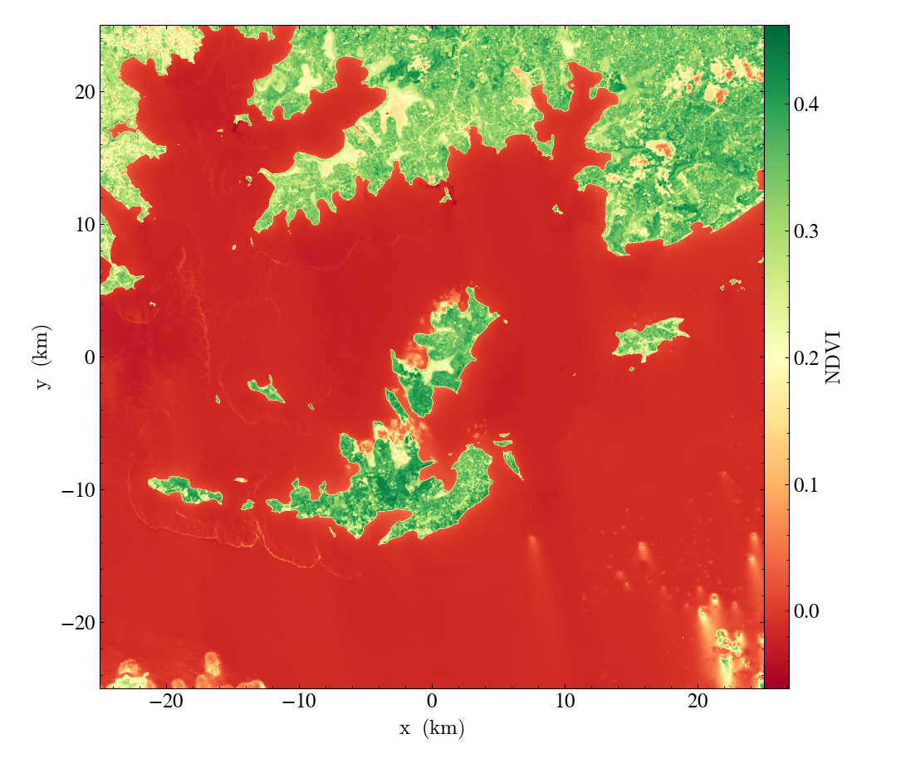
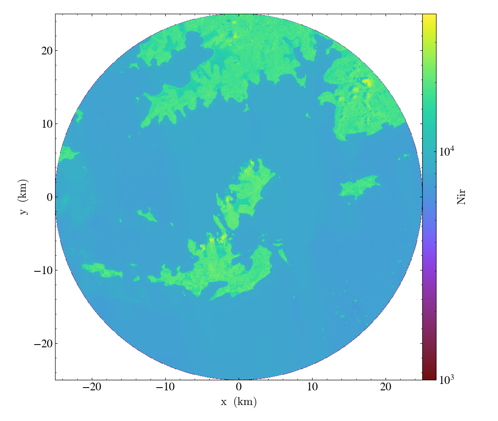

.. _ytgr_plotting:

Plotting Data
=============

``yt`` offers a lot of functionality for plotting. See :ref:`how-to-make-plots`
for a full discussion. However, the spatial plots are geared mainly to 3D data,
so ``yt_georaster`` provides a simple interface to making spatial plots of 2D
data. The :func:`~yt_georaster.data_structures.GeoRasterDataset.plot` function
will plot a single field, accepting optional arguments for a center, width,
and height. If you are working in a Jupyter notebook, use ``p.show()`` to
display the plot inline.

.. code-block:: python

   >>> import yt
   >>> import yt.extensions.georaster

   >>> filenames = glob.glob("Landsat-8_sample_L2/*.TIF") + \
   ...   glob.glob("M2_Sentinel-2_test_data/*.jp2")
   >>> ds = yt.load(*filenames)

   >>> field = ("LC08_L2SP_171060_20210227_20210304_02_T1", "NDVI")
   >>> p = ds.plot(field, center=ds.domain_center,
   ...             width=(50, "km"), height=(50, "km"))
   >>> p.set_cmap(field, "RdYlGn")
   >>> p.save("plot_1.png")

Plotting Data Containers
------------------------

The :func:`~yt_georaster.data_structures.GeoRasterDataset.plot` function also
accepts a ``data_source`` keyword to plot data only within the container. The
center, width, and heigh will be set automatically base on the container.

.. code-block:: python

   >>> cir = ds.circle(ds.domain_center, (25, "km"))
   >>> field = ('LC08_L2SP_171060_20210227_20210304_02_T1', "nir")
   >>> p = ds.plot(field, data_source=cir)
   >>> p.set_zlim(field, 1000, 40000)
   >>> p.set_axes_unit('km')
   >>> p.save("plot_2.png")

.. code-block:: python

   >>> poly = ds.polygon("example_polygon_mabira_forest/mabira_forest.shp")
   >>> field = ("LC08_L2SP_171060_20210227_20210304_02_T1", "NDVI")
   >>> p = ds.plot(field, data_source=poly)
   >>> p.set_cmap(field, "RdYlGn"))
   >>> p.set_axes_unit("km")
   >>> p.save("plot_3.png")

.. image:: _static/images/plot_3.png
