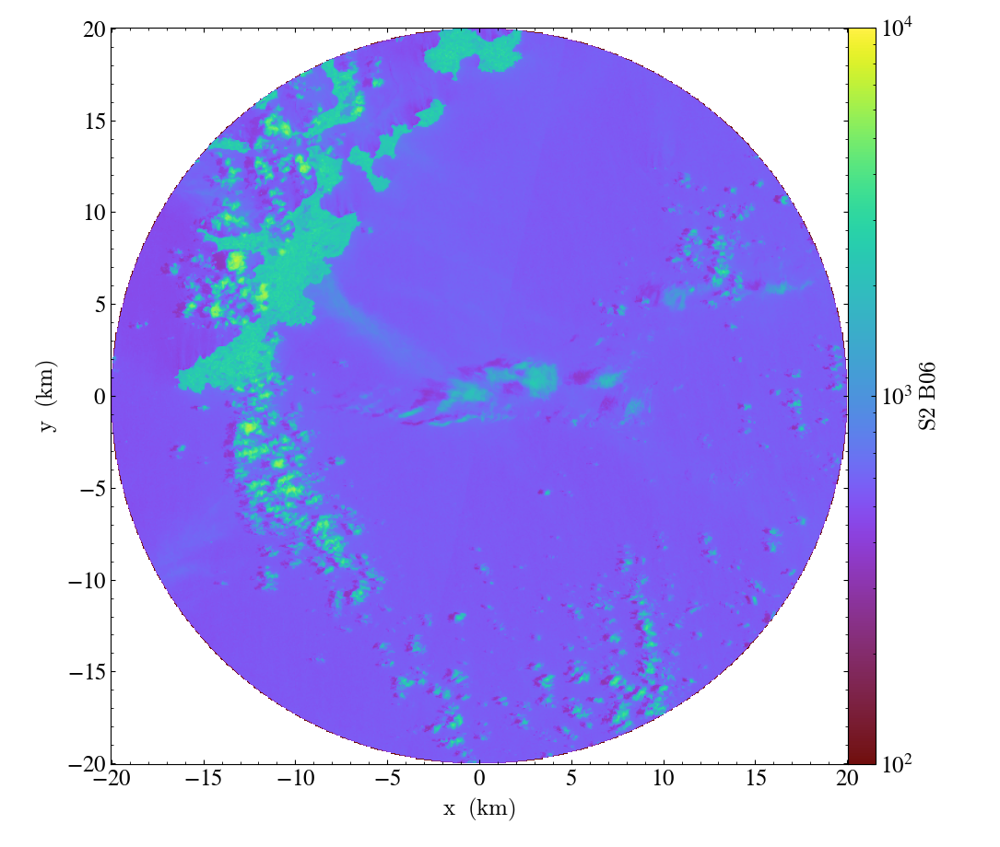

Saving GeoTIFFs
===============

The :func:`~yt_georaster.utilities.save_as_geotiff` function will save
loaded images to a single, multiband GeoTIFF file. By default, all loaded
on-disk fields will be saved for the region spanning :ref:`ytgr_base_image`.
An optional list of fields (including aliases and derived fields) can be
given to save a subset of all fields. Additionally, a data container can be
provided with the ``data_source`` keyword to save only pixels inside the
container.

.. code-block:: python

   >>> import yt
   >>> import yt.extensions.georaster

   >>> filenames = glob.glob("M2_Sentinel-2_test_data/*.jp2") + \
   ...   glob.glob("Landsat-8_sample_L2/*.TIF") + \
   >>> ds = yt.load(*filenames)
   yt : [INFO     ] 2021-06-30 14:32:43,143 Parameters: domain_dimensions         = [1830 1830    1]
   yt : [INFO     ] 2021-06-30 14:32:43,143 Parameters: domain_left_edge          = [ 399960. 9890200.       0.] m
   yt : [INFO     ] 2021-06-30 14:32:43,143 Parameters: domain_right_edge         = [5.0976e+05 1.0000e+07 1.0000e+00] m

   >>> circle = ds.circle(ds.domain_center, (20, "km"))
   >>> fields = [("T36MVE_20210315T075701", "S2_B06"),
   ...           ("T36MVE_20210315T075701", "NDWI"),
   ...           ("LC08_L2SP_171060_20210227_20210304_02_T1", "L8_B1"),
   ...           ("LC08_L2SP_171060_20210227_20210304_02_T1", "LS_temperature")]

   >>> ds_fn, fm_fn = save_as_geotiff(
   ...     ds, "my_data.tif",
   ...     fields=fields, data_source=circle)
   yt : [INFO     ] 2021-06-30 14:32:43,556 Saving 4 fields to my_data.tif.
   yt : [INFO     ] 2021-06-30 14:32:43,556 Bounding box: [ 434820. 9925060.] m m - [ 474900. 9965140.] m m with shape (668, 668).
   yt : [INFO     ] 2021-06-30 14:32:43,575 Saving ('LC08_L2SP_171060_20210227_20210304_02_T1', 'L8_B1') to band 1/4.
   yt : [INFO     ] 2021-06-30 14:32:43,689 Resampling ('LC08_L2SP_171060_20210227_20210304_02_T1', 'L8_B1_30m'): 30.0 to 60.0 m.
   yt : [INFO     ] 2021-06-30 14:32:43,836 Saving ('T36MVE_20210315T075701', 'S2_B06') to band 2/4.
   yt : [INFO     ] 2021-06-30 14:32:44,174 Resampling ('T36MVE_20210315T075701', 'S2_B06_20m'): 20.0 to 60.0 m.
   yt : [INFO     ] 2021-06-30 14:32:44,535 Saving ('T36MVE_20210315T075701', 'NDWI') to band 3/4.
   yt : [INFO     ] 2021-06-30 14:32:45,599 Resampling ('T36MVE_20210315T075701', 'S2_B03_10m'): 10.0 to 60.0 m.
   yt : [INFO     ] 2021-06-30 14:32:45,950 Resampling ('T36MVE_20210315T075701', 'S2_B8A_20m'): 20.0 to 60.0 m.
   yt : [INFO     ] 2021-06-30 14:32:46,987 Resampling ('T36MVE_20210315T075701', 'S2_B03_10m'): 10.0 to 60.0 m.
   yt : [INFO     ] 2021-06-30 14:32:47,337 Resampling ('T36MVE_20210315T075701', 'S2_B8A_20m'): 20.0 to 60.0 m.
   yt : [INFO     ] 2021-06-30 14:32:47,386 Saving ('LC08_L2SP_171060_20210227_20210304_02_T1', 'LS_temperature') to band 4/4.
   yt : [INFO     ] 2021-06-30 14:32:47,504 Resampling ('LC08_L2SP_171060_20210227_20210304_02_T1', 'L8_B10_30m'): 30.0 to 60.0 m.
   yt : [INFO     ] 2021-06-30 14:32:47,684 Field map saved to my_data_fields.yaml.
   yt : [INFO     ] 2021-06-30 14:32:47,684 Save complete. Reload data with:
   ds = yt.load("my_data.tif", field_map="my_data_fields.yaml")

The :func:`~yt_georaster.utilities.save_as_geotiff` function will return
paths to the saved GeoTIFF file as well as a supplementary yaml file containing
a mapping from the GeoTIFF bands to the original field names. This can be
provided to ``yt.load`` using the ``field_map`` keyword so the fields in the
new file can be accessed with the original names.

.. code-block:: python

   >>> ds_new = yt.load(ds_fn, field_map=fm_fn)
   yt : [INFO     ] 2021-06-30 14:44:51,851 Parameters: domain_dimensions         = [668 668   1]
   yt : [INFO     ] 2021-06-30 14:44:51,851 Parameters: domain_left_edge          = [ 434820. 9925060.       0.] m
   yt : [INFO     ] 2021-06-30 14:44:51,852 Parameters: domain_right_edge         = [4.74900e+05 9.96514e+06 1.00000e+00] m

   >>> print (ds_new.field_list)
   [('LC08_L2SP_171060_20210227_20210304_02_T1', 'L8_B1'),
    ('LC08_L2SP_171060_20210227_20210304_02_T1', 'LS_temperature'),
    ('T36MVE_20210315T075701', 'NDWI'),
    ('T36MVE_20210315T075701', 'S2_B06')]

   >>> field = ("T36MVE_20210315T075701", "S2_B06")
   >>> p = ds_new.plot(field)
   >>> p.set_zlim(field, 100, 10000)
   >>> p.set_axes_unit("km")
   >>> p.save("plot_4.png")

